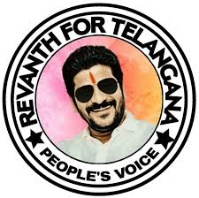

# revanth
info RR
<!DOCTYPE html>
<html lang="en">
<head>
    <meta charset="UTF-8">
    <meta name="viewport" content="width=, initial-scale=1.0">
    <title>Document</title>
    <link rel="stylesheet" href="style2.CSS">
</head>
<body class="rang">
    

        <h1 class="heading">CONGRESS LEADER</h1>
        <h3 class="angle">Cheif Minister of Telangana</h3>
        
        
<b>Anumula Revanth Reddy</b>

        
RR is an indian politican who is serving as the secound and current <i>Cheif Minister of Telangana</i> since 7 December 2023. 

        
As a member of the Indian National Congress, he is the current MLA for kodangal

        
ఎనుముల రేవంత్ రెడ్డి, రాష్ట్ర రెండవ ముఖ్యమంత్రిగా రేవంత్ ఎన్నికయ్యాడు. అతను 2023 తెలంగాణా శాసనసభ ఎన్నికలలో కొడంగల్ నియోజకవర్గం నుండి శాసనసభ్యుడుగా ఎన్నికయ్యాడు.

        <a href="http://youtube.com/watch?v=FWgKmMz1Rjg">
            <button class="youtube">Clicke here for more info</button>
        </a>
    

    

        <ul>
            <li>REVANTH REDDY</li>
            <li>HYDERABAD</li>
        </ul>
        <ol>
            <li>CHEIF MINISTER</li>
            <li>TELANGANA</li>
        </ol>
        <table border="1" cellpadding="20" class="rangas">
            <tr class="rangt">
                <th>S.NO</th>
                <th>MLA name</th>
                <th>area</th>
            </tr>
            <tr>
                <td><b>1</b></td>
                <td><a href="https://www.oneindia.com/politicians/anumula-revanth-reddy-50579.html">REVANTH REDDY</a></td>
                <td>KODANGAL</td>
            </tr>
            <tr class="rangtt">
                <td><b>2</b></td>
                <td><a href="https://www.oneindia.com/politicians/konda-surekha-51068.html" class="ranga">KONDA SUREKHA</a></td>
                <td>WARANGAL</td>
            </tr>
        </table>
    

    

        <form class="rangtt">
            <label for="name">enter your name:</label>
            <input type="text" id="name" name="name"></input>
        </form>
    

</body>
</html>

style2.css
.revanth{
    text-align: center;
}
.heading{
    color: rgb(255, 32, 32);
    background-color: rgb(161, 255, 224);
}
.geetha1{
    color: orangered;
}
.geetha2{
    color: rgb(255, 255, 255);
}
.geetha3{
    color: rgb(100, 237, 127);
}
.geetha4{
    color: red;
}
.angle{
    text-align: middle;
}
.rang{
    background-color: rgb(0, 0, 0);
}
.bomma{
    border-radius: 50%;
}
.youtube{
    color: violet;
}
.rang2{
    color: azure;
    list-style-type: square;
    list-style-position: outside ;
    margin: auto;
}
.rangt{
    color: rgb(255, 0, 0);
    border-color: rgb(255, 0, 0);
}
.rangtt{
    color: rgb(17, 255, 0);
    border-color: darkgreen;
}
.rangttt{
    color: rgb(255, 255, 255);
}
.ranga{
    color: rgb(17, 255, 0);
}
table, th, td {
    border: 1px solid;
    border-radius: 10px;
}
ul {
    color: aquamarine;
}
ol{
    color: aquamarine;
}
